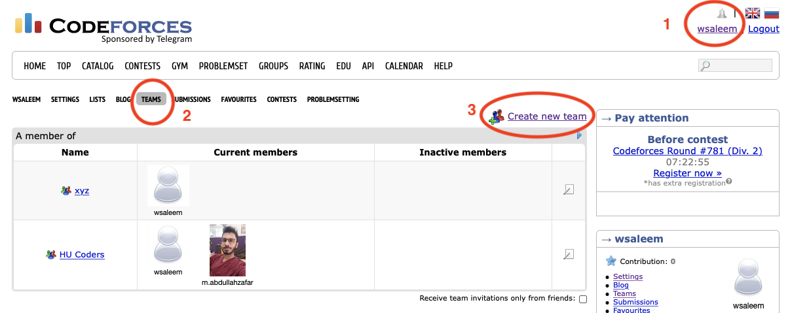

# Code Game, Spring 2022

Below is important information regarding the contest. As much as possible, the contest will follow the [ICPC](https://icpc.global/) format. The platform on which the contest will be held is [CodeForces](https://codeforces.com/).

## Format

All teams will be assigned the same problem set through CodeForces. You will also be given a hard copy of the problem set. You will write programs to solve the problems and submit your solutions through CodeForces for automatic testing against prepared test cases which are not visible to you. Your score in the contest depends on the number of correct solutions that you submit and how quickly you submit them. More details on scoring are given below.

## Logistics

The competition takes place on Saturday, 9 April, in Linux Lab, from 11-13h. Your team should reach the lab by 1045h so that you are settled in by 11h when the contest begins.

## Registration

Prior registration is required to participate in the context. In order to register, you will need:

1. a CodeForces username,
2. a CodeForces team (see instructions below)
3. an invitation to register

Updates on the registration process, if any, will be shared in the Teams chat.

### Teams

Once you and your buddies have registered on CodeForces, you can form your team as follows. Once you are logged in to CodeForces,

1. Click on your username on the top right,
1. Click on "TEAMS" in the top menu,
1. Click on "Create new team",
1. Add your buddies' usernames.

## Participation

Participation is in teams of 3. Each team will use a single computer with _no Internet access_ except to CodeForces. Rough paper will be provided but you must have your own writing implements. You will have to submit your devices during participation.

## Scoring

A scoreboard with live scores of all the participating teams will be projected on the screen. Scores are computed as follows.

- Teams are grouped in the scoreboard by the number of problems that they have correctly solved.
- Groups with more correct solutions are ranked higher.
- A team's score in any problem is the sum of:
  - the number of minutes between the start of the contest and the submission of a correct solution
  - any penalty
- There is a penalty for each incorrect submission.
- Within a group, the team with the lesser score is ranked higher.

