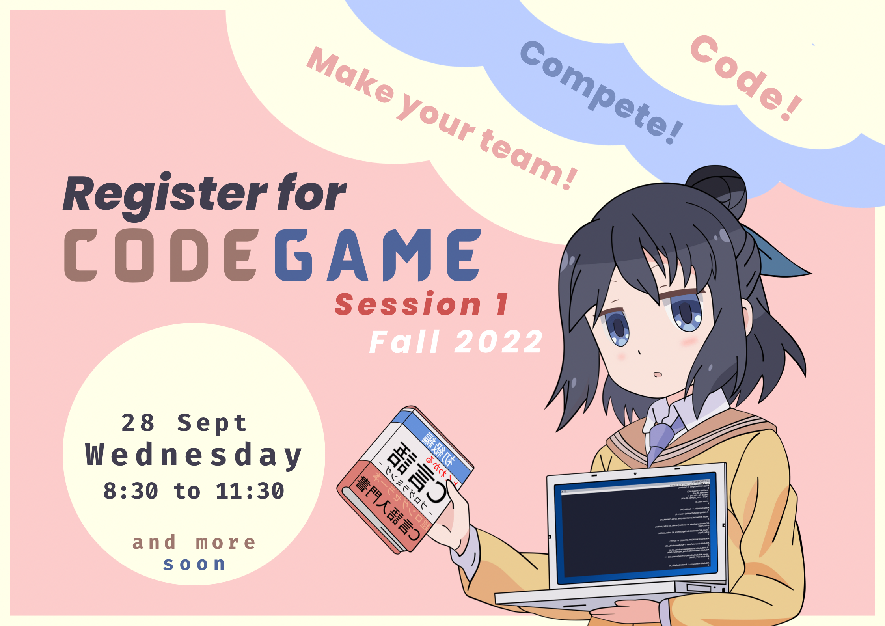

# Code Game, Fall 2022, Session 1

The contest will be held on [CodeForces](https://codeforces.com/) and will follow the [ICPC](https://icpc.global/) format. Read below for futher information and instructions.

(_Archived Code Games_: [Spring 2022](./spring-22.html))

----

## Format

All teams will be assigned the same problem set through CodeForces. You will also be given a hard copy of the problem set. You will write programs to solve the problems and submit your solutions through CodeForces for automatic testing against prepared test cases which are not visible to you. Your score in the contest depends on the number of correct solutions that you submit and how quickly you submit them. More details on scoring are given below.

## Logistics

The contest takes place on Wednesday, 28 September, in Math Lab, from 845-1130h. Your team should reach the lab by 830h so that you are settled in when the contest begins.

Prior registration through [this form](https://forms.office.com/r/tm1WFaNYax) is required. In order to register, you will need:

1. a CodeForces username,
2. a CodeForces team (see instructions below)
3. an invitation to register

## Teams

Once you and your buddies have registered individually on CodeForces, you can form your team as follows. Log in to CodeForces and

1. click on your username on the top right,
1. click on "TEAMS" in the top menu,
1. click on "Create new team",
1. add your buddies' usernames.

## Participation

Participation is in teams of 3. Each team will use a single computer with _no Internet access_ except to CodeForces. Rough paper will be provided but you must have your own writing implements. You will have to submit your devices prior to the start of the competition.

## Scoring

A scoreboard with live scores of all the participating teams will be projected on the screen. Scores are computed as follows.

- Teams are grouped in the scoreboard by the number of problems that they have correctly solved.
- Groups with more correct solutions are ranked higher.
- Within a group, the team with the lesser score is ranked higher.
- A team's score in any problem is the sum of:
  - the number of minutes between the start of the contest and the submission of a correct solution
  - the penalties for each incorrect submission for the problem.

## Prizes and Review
There is a certificate for each of the following teams
- the team with the overall first rank
- the team with the overall second rank
- the team with the overall third rank
- [Neophytes]: the best performing team consisting of all students in their first year.
- [Wise Fools](https://www.wgbh.org/news/2017/10/25/how-we-live/what-exactly-sophomore-and-what-does-it-mean-be-junior-and-senior): the best performing team consisting of all students in their sophomore year.
- [Coder Girls](https://www.facebook.com/girlsintechsg/photos/a.10150798804401928/10158017542091928/?type=3): the best performing team consisting of all female students.

We will take a short break at the end of the competition. This will be followed by a brief review of the problems and handing out of the certificates.

## Teams

The registered teams for Code Game, Fall 2022, Session 1 so far are as follows. Team names in _italics_ have been assigned.

|   | Team  | Member  | Member  | Member  | Special Eligibility  |
| - | - | - | - | - | - |
| |  |  | | | | 
| |  |  | | | | 
| |  |  | | | |
| |  |  | | | |
| |  |  | | | |
| |  |  | | | |
| |  |  | | | |
| |  |  | | | |
| |  |  | | | |
| |  |  | | | |
| |  |  | | | |
| |  |  | | | |

