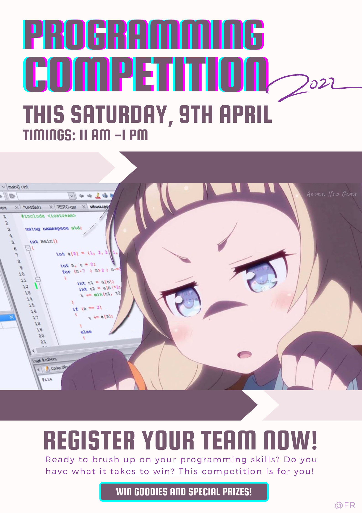

# Code Game, Spring 2022

Below is important information regarding the contest. As much as possible, the contest will follow the [ICPC](https://icpc.global/) format. The platform on which the contest will be held is [CodeForces](https://codeforces.com/).

## Format

All teams will be assigned the same problem set through CodeForces. You will also be given a hard copy of the problem set. You will write programs to solve the problems and submit your solutions through CodeForces for automatic testing against prepared test cases which are not visible to you. Your score in the contest depends on the number of correct solutions that you submit and how quickly you submit them. More details on scoring are given below.

## Logistics

The contest takes place on Saturday, 9 April, in Linux Lab, from 11-13h. Your team should reach the lab by 1045h so that you are settled in by 11h when the contest begins.

## Registration

Prior registration is required to participate in the contest. In order to register, you will need:

1. a CodeForces username,
2. a CodeForces team (see instructions below)
3. an invitation to register

Updates on the registration process, if any, will be shared in the Teams chat.

### Teams

Once you and your buddies have registered on CodeForces, you can form your team as follows. Once you are logged in to CodeForces,

1. Click on your username on the top right,
1. Click on "TEAMS" in the top menu,
1. Click on "Create new team",
1. Add your buddies' usernames.

## Participation

Participation is in teams of 3. Each team will use a single computer with _no Internet access_ except to CodeForces. Rough paper will be provided but you must have your own writing implements. You will have to submit your devices during participation.

## Scoring

A scoreboard with live scores of all the participating teams will be projected on the screen. Scores are computed as follows.

- Teams are grouped in the scoreboard by the number of problems that they have correctly solved.
- Groups with more correct solutions are ranked higher.
- Within a group, the team with the lesser score is ranked higher.
- A team's score in any problem is the sum of:
  - the number of minutes between the start of the contest and the submission of a correct solution
  - the penalties for each incorrect submission for the problem.

## Prizes and Review
There is a prize for each of the top 3 ranked positions.

Additionally, there are special participation prizes.

1. Up and Coming: awarded to the top ranked team whose members are all currently in their first year.
1. [Wise Fools](https://www.wgbh.org/news/2017/10/25/how-we-live/what-exactly-sophomore-and-what-does-it-mean-be-junior-and-senior): awarded to the top ranked team whose members are all currently in their sophomore year.
1. [Coder Girls](https://www.facebook.com/girlsintechsg/photos/a.10150798804401928/10158017542091928/?type=3): awarded to the top ranked team whose members are all female.

A brief session on selected problems from the contest will be held from 1315-1345h. Certificates will be awarded to the prize winners at the end of the review session.

## Teams

The registered teams for Code Game, Spring 2022 so far are as follows. Team names in _italics_ have been assigned.

|   | Team  | Member  | Member  | Member  | Special Eligiblity  |
| - | - | - | - | - | - |
| 1  | Snakes                | Sandesh Kumar | Iqra Siddiqui | Haania Siddiqui | | 
| 2  | ashthetic.py		     | Syed Muhammad Abbas Haider Taqvi | Syed Muhammad Safi Haider Rizvi | Syed Muhammad Hussain | Wise Fools | 
| 3  | _Seg Fault_			 | Ali Asghar Yousuf | Saad Abdul Hakim Qureshi | Shehryar Amin | Wise Fools |
| 4  | Multiverse			 | Mujtaba Syed | Ifrah Ilyas | Khubaib Naeem Kasbati | |
| 5  | MonkeyType			 | Meesum Ali Qazalbash | Ronit Kumar Kataria | Muhammad Murtaza | Wise Fools |
| 6  | The Assassin's Creed  | Hamad Razzaq | Lakshman Maheshwari | Muhammad Jazzel Mehmood | Wise Fools |
| 7  | FSM					 | Muneeb Shafique | Sajeel Alam | Fatima Alvi | Wise Fools |
| 8  | HU Titans			 | Muhammad Oqba bin Jawed | abdul majid tanveer | Maha Usmani | Wise Fools |
| 9  | GigaCorpus			 | Muhammad Najeeb Jilani | Ahmed Atif | Jahania Shah | Wise Fools |
| 10 | _Aleph Null_          | Ali Rizvi | Mehdi Raza Khurasani | Syed Muhammad Ali Rizvi | |
| 11 | Titanic               | Sameer Pervez | Fizza Rubab | Ruhama Naeem | |
| 12 | PehlwanGOATS X Pappa  | Syed Muhammad Abbas Haider | Agha Syed Nasir Mahmood Azeemi | Moid Ul Huda | |

